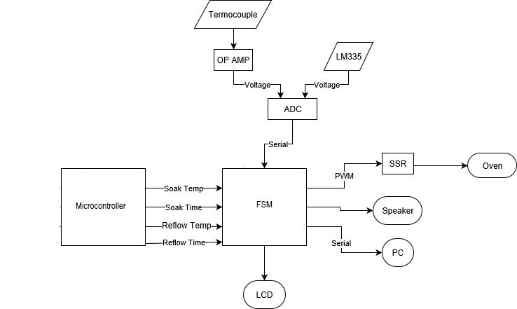
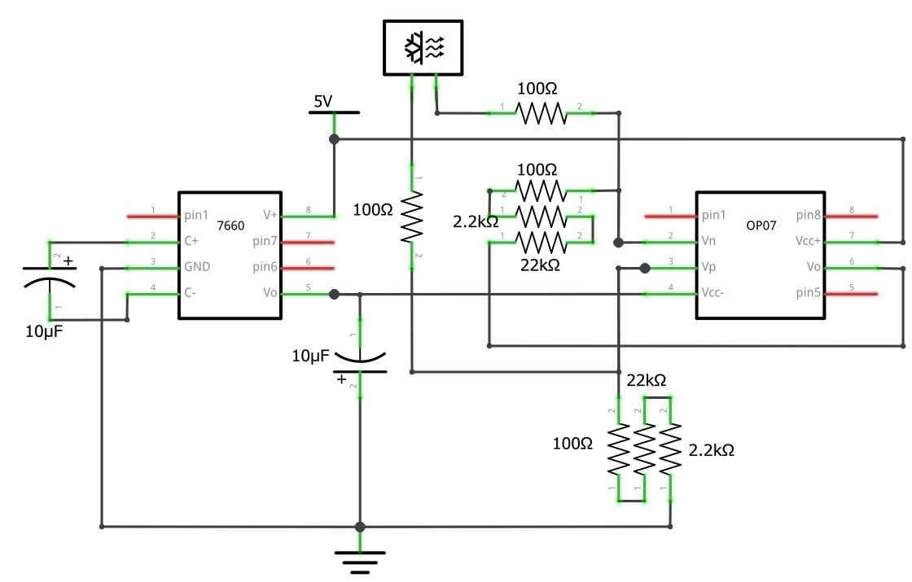

# ELEC291P1
Reflow Oven Controller - A.K.A Lit Solder Controller

**PROJECT COMPLETED**

## Resources

**GitHub Pages**: https://fsxac.github.io/ELEC291P1/

**Trelle Link**: https://trello.com/b/4QynfMXc/project-1-lit-solder-controller

**Google Drive**: https://drive.google.com/drive/folders/0B7_AKRr0ByjpWmxVZVN0MWlLRlU

## Hardware

AT89LP52 Microcontroller

- **Input**: ADC module, LM335, thermocouple, buttons
- **Output**: Serial to PC (via USB), PWM SSR control, speaker, LCD, LED

### System Configuration

### OPAMP Configuration

### Task 1: Circuit and Hardware Assembly

- [x] Assemble OP AMP
- [x] Attach OP AMP to thermocouple
- [x] Attach LM335 for temperature offset
- [x] Attach sensors to ADC, attach ADC to microcontroller

## Software

### Task 1: Reflow FSM

- [x] Program reflow FSM shown in diagram on lecture slides
- [x] Integrate FSM with interface
- [x] Test FSM
- [x] Add required sound and LCD outputs during each transition

### Task 2: SSR Controller

### Task 3: Interface and Configuration (FSM)

*important*: `crtTemp` should be temperature input from sensors

- [x] Wire up `crtTemp` to sensors

- [x] Update LCD Screen for each state
- [x] Make marcos for incrementing and decrementing temperature
- [x] Program what happens when you press start while on the main screen
- [x] Make macros for setting time
- [x] Modify code for 3 digit temperature readings
- [x] Unit test interface
- [x] Unit test FSM
- [x] Integration to main program

## Pin Assignment

|  Pin | Assignment            |
| ---: | --------------------- |
| P0.0 | Buzzer Output         |
| P0.1 | *unassigned*          |
| P0.2 | *unassigned*          |
| P0.3 | *unassigned*          |
| P0.4 | *unassigned*          |
| P0.5 | *unassigned*          |
| P0.6 | *unassigned*          |
| P0.7 | *unassigned*          |
| P2.0 | ADC - CE              |
| P2.1 | ADC - MOSI            |
| P2.2 | ADC - MISO            |
| P2.3 | ADC - SCLK            |
| P2.4 | Button - Start / Stop |
| P2.5 | Button - State        |
| P2.6 | Button - Up           |
| P2.7 | Button - Down         |
| P3.7 | SSR Output            |

## Extra Features
